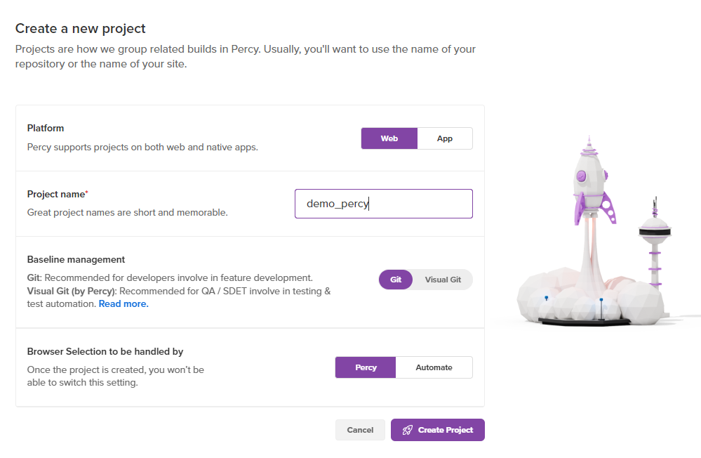

Percy:
1. create an account in percy
2. create a project

3. create npm project - `npm init` and will created package.json
4. install percy `npm install --save-dev @percy/cli`

Python Setup:
1. create virtual env `python -m venv .venv`
2. activate virtual environemnt , in windows `.venv\Scripts\activate.bat`
3. install selenium `pip install selenium`
4. install percy `pip install percy-selenium`
5. create python selenium test, and test as `python pythonIntegration\test_selenium_python.py`

Intergrate percy with python
1. set the toke `set PERCY_TOKEN=web_1e6a80595ade1841984eebf4fed1816ddc5ed2a99dd3b47a8fc4668beb3`# demo token, get the correct one
2. run percy as `npx percy exec -- python pythonIntegration\test_selenium_python.py`

Integraion with testcafe:
1. install the dependency `npm install --save-dev @percy/cli @percy/testcafe`
2. install testcafe `npm install --save-dev testcafe`
3. excute percy - `npx percy exec -- testcafe chrome .\testcafe_integration\test_testcafe.js`

***********git and GitHub************************
1. `git remote add origingithub https://github.com/simpleappdesigner/testautomationtestcafe.git`
2. verify with `git remote -v`
3. git push to new branch: `git push -u origingithub HEAD:percyseleniumtestcafe`
