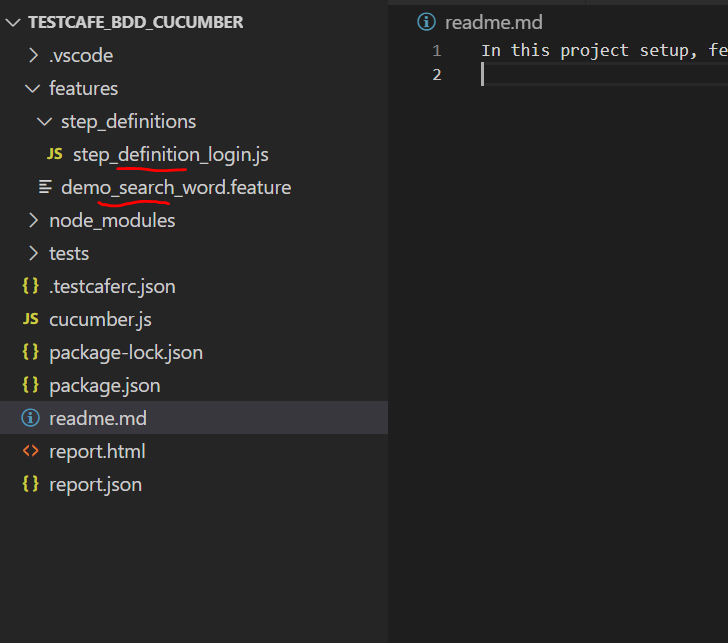
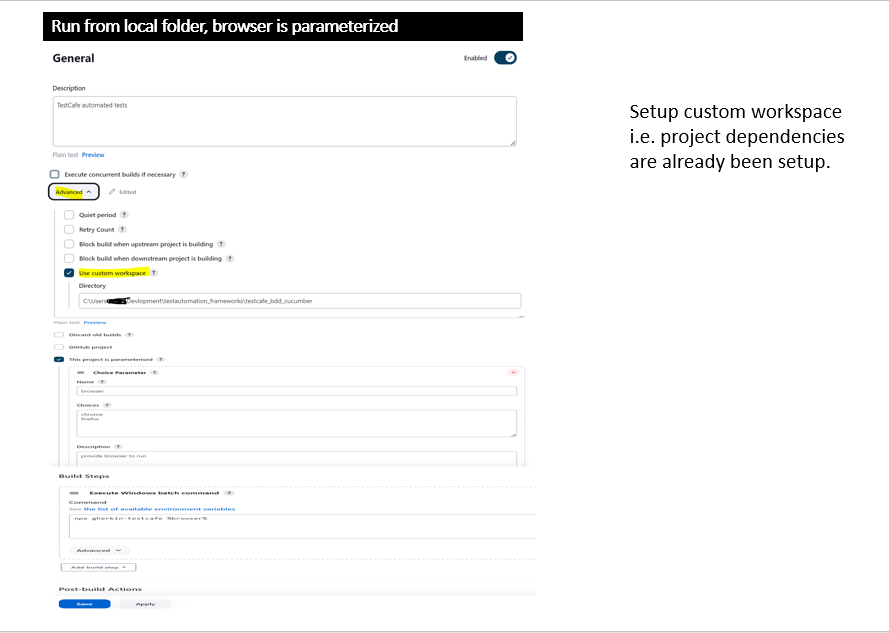
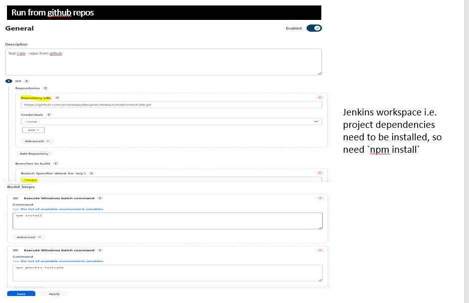
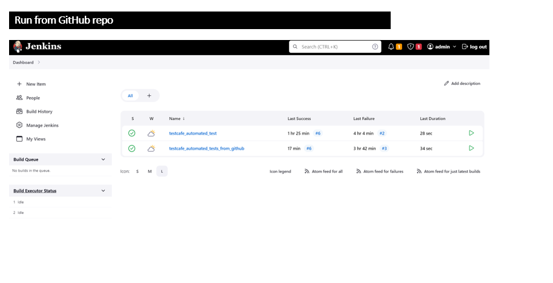

In this project setup, feature file and step definitions at the following:

So this need to be defined in .testcaferc.json. 
`"src": ["node_modules/testcafe-cucumber-steps/index.js", "tests/**/*.js", "tests/**/*.featureignore","features/**/*.js","features/**/*.feature"]`

1. Command - `npx cucumber-js --require features` to find if there is any missing step definition.
2. `npx gherkin-testcafe` executes the test cases or `npm run test:firefox`
3. `npx gherkin-testcafe --reporter html:report.html  ` report with name report.html to be created.z
4. another way to get allure reports.
    1. install `npm install testcafe-reporter-allure -D`
    2. run tests to create allure reports `npx gherkin-testcafe --reporter allure `
    3. to view report install `npm install -g allure-commandline -D` and then run 
        1. create report `npx allure generate allure/allure-results --clean -o allure/allure-report`
        2. view report `npx allure open allure/allure-report`

Get Started! (git and Node installed in the system)

1. `mkdir  testautomationtestcafe`
2. `cd testautomationtestcafe`    
3. `git clone https://github.com/simpleappdesigner/testautomationtestcafe.git`
4. `npm install`
5. `npx gherkin-testcafe` or with slow speed `npx gherkin-testcafe --speed 0.1`
or record video `npx gherkin-testcafe --speed 0.1 --video reports/screen-captures --video-options singleFile=true`
6. allure reports:
    1. `npx gherkin-testcafe --reporter allure`
    2. `npx allure generate allure/allure-results --clean -o allure/allure-report`
    3. `npx allure open allure/allure-report`

Jenkins->
1. download war file from https://www.jenkins.io/download/
2. create jenkins_war folder and keep downloaded jenkins.war to this folder.
3. Follow https://www.jenkins.io/doc/book/installing/war-file/ and run the following command in terminal/command line
     `java -jar .\jenkins_war\jenkins.war --httpPort=9090` Note: if get java version error, upgrade your java.
4. `start chrome http://localhost:9090` and will open "Unlock" jenkins page, enter password from file ....jenkins\secrets\initialAdminPassword
5. Click on install recommended plugins
6. Setup a new build job, follow:

